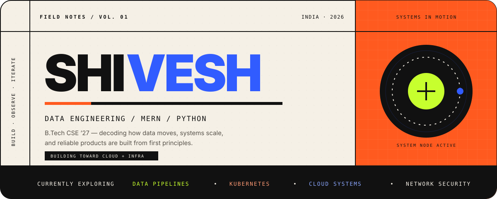
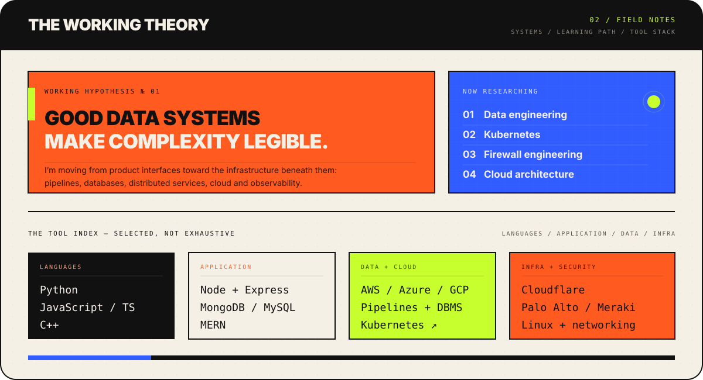
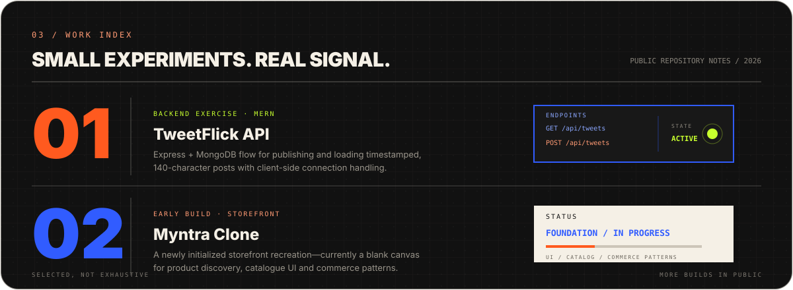
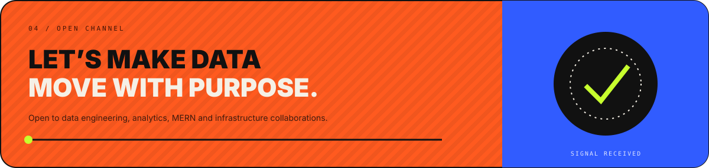

  

   

  
  
  
  
  

 

  

 

  

  

  

 

  
    Contributions, experiments and active builds are visible across my repositories.
  

 

  

  

  

 

  Learning in public · Building one system at a time · India

