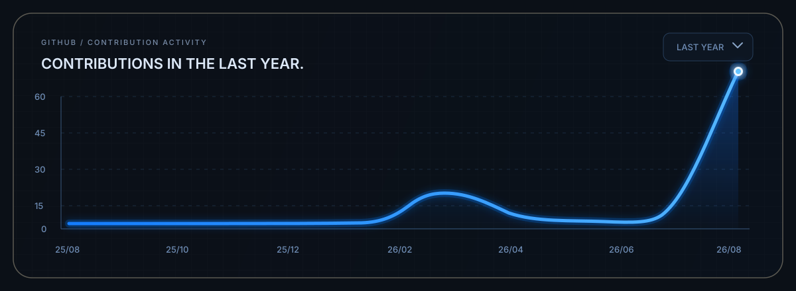
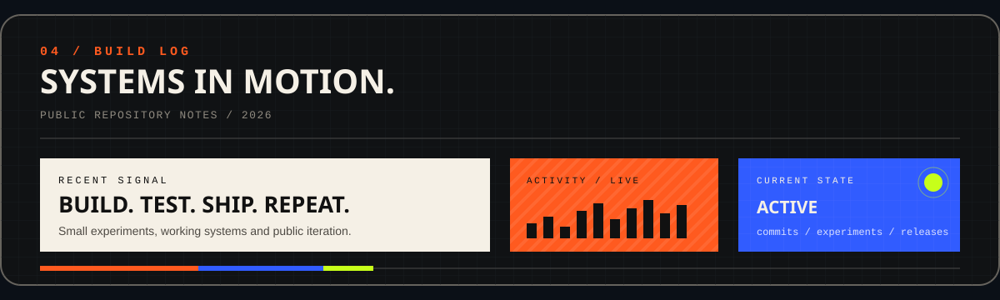

<div align="center">


  <br />

  <a href="https://github.com/sh1vesh?tab=followers">
    
  </a>

  <a href="https://www.linkedin.com/in/shen83/">
    
  </a>

  <a href="https://x.com/bl3_eed">
    
  </a>

  <a href="mailto:shivesh85674@gmail.com">
    
  </a>


</div>

<br />

<div align="center">
  
</div>

<br />

<div align="center">
  
</div>

<br />

<div align="center">

  <a href="https://github.com/sh1vesh/X-Clone-Live-time-single-tweets-">
    
  </a>

  <a href="https://github.com/sh1vesh/Myntra-Clone">
    
  </a>

  <a href="https://github.com/sh1vesh/Freedom-Path-FIRE-Calculator-">
    
  </a>

</div>

<br />

<div align="center">
  
</div>

<br />

<div align="center">
  
</div>

<br />

<div align="center">
  
</div>

<br />

<div align="center">

  <a href="mailto:shivesh85674@gmail.com">
    
  </a>

  <a href="https://github.com/sh1vesh?tab=repositories">
    
  </a>

</div>

<br />

---

## About

I build across **data engineering, full-stack development, cloud infrastructure and automation**.

My projects usually focus on understanding how real products are structured, rebuilding them from the ground up, experimenting with APIs and automation, and documenting what I learn along the way.

---

## Selected Experiments

### 01 — TweetFlick API

A browser-based automation experiment designed around X/Twitter engagement workflows.

**Core features**

* Session-based automation
* Queue mode
* Auto timeline scrolling
* Configurable interaction delay
* Auto liker
* Multiple response tones
* Tweet collection and analysis
* Session logging
* CSV / JSON-style data handling
* Chrome extension based interface

**Stack**

`Python` `JavaScript` `HTML` `CSS` `Chrome Extension APIs` `JSON`

[View Repository](https://github.com/sh1vesh/X-Clone-Live-time-single-tweets-)

---

### 02 — Myntra Clone

A frontend recreation of the Myntra shopping experience built to understand catalogue layouts, navigation systems and e-commerce interface patterns.

**Core features**

* Responsive navigation
* Product/category sections
* Promotional banners
* Image-based catalogue layout
* Interactive frontend behaviour
* Reusable styling utilities

**Stack**

`HTML` `CSS` `JavaScript`

[View Repository](https://github.com/sh1vesh/Myntra-Clone)

---

### 03 — FreedomPath

A FIRE calculator designed to explore financial independence, long-term savings, investing assumptions and retirement planning.

**Core features**

* FIRE target calculation
* Savings projections
* Expense modelling
* Investment assumptions
* Financial independence estimates
* Interactive calculations

**Stack**

`JavaScript` `HTML` `CSS` `Financial Modelling`

[View Repository](https://github.com/sh1vesh/Freedom-Path-FIRE-Calculator-)

---

## GitHub Resume

### Contribution Activity

My GitHub activity reflects the systems, experiments and projects I am currently building and documenting.

---

## What I'm Exploring

```text
DATA
├── Data Engineering
├── ETL Pipelines
├── SQL
├── Data Warehousing
└── Distributed Systems

WEB
├── JavaScript
├── React
├── Node.js
├── REST APIs
└── Full-stack Architecture

INFRASTRUCTURE
├── Cloud Computing
├── Docker
├── CI/CD
├── Linux
└── Deployment

EXPERIMENTS
├── Browser Automation
├── Chrome Extensions
├── APIs
├── Product Cloning
└── Developer Tooling
```

---

## Build Philosophy

```text
01  Understand the system
02  Break it into smaller components
03  Rebuild the important parts
04  Test assumptions
05  Document the process
06  Improve the implementation
```

I use projects as a way to understand not only **how something works**, but also **why it was built that way**.

---

## Current Direction

```text
SYSTEMS
     ↓
DATA
     ↓
BACKEND
     ↓
CLOUD
     ↓
PRODUCT
```

The goal is to build stronger fundamentals across the complete software lifecycle — from application logic and data systems to infrastructure and deployment.

---

## Tech

`Python` `JavaScript` `React` `Node.js` `HTML` `CSS` `SQL` `MongoDB` `Git` `GitHub` `Docker` `Linux` `AWS`

---

## Activity

```text
Currently building

→ full-stack projects
→ automation experiments
→ data engineering projects
→ cloud infrastructure projects
→ product recreations
```

---

## Connect

**GitHub**
[@sh1vesh](https://github.com/sh1vesh)

**LinkedIn**
[Shivesh](https://www.linkedin.com/in/shen83/)

**X**
[@BL3_EED](https://x.com/bl3_eed)

**Email**
[shivesh85674@gmail.com](mailto:shivesh85674@gmail.com)

---

### Open to collaboration.

Building, experimenting and learning in public.

<div align="center">
  <sub>
    Learning in public · Building one system at a time · India
  </sub>
</div>
